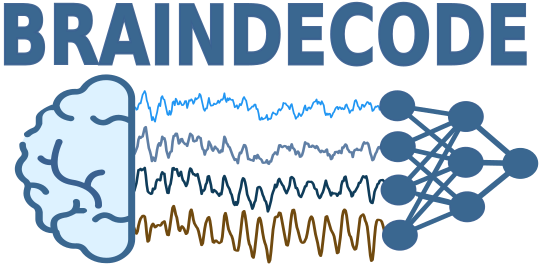

:html_theme.sidebar_secondary.remove:

.. title:: Braindecode

.. The page title must be in rST for it to show in next/prev page buttons.
   Therefore we add a special style rule to only this page that hides h1 tags

.. raw:: html

    

Braindecode Homepage
====================

.. LOGO

.. rst-class:: h4 text-center font-weight-light my-4

   Braindecode is an open-source Python toolbox for decoding raw electrophysiological brain
   data with deep learning models. It includes dataset fetchers, data preprocessing and
   visualization tools, as well as implementations of several deep learning
   architectures and data augmentations for analysis of EEG, ECoG and MEG.

.. rst-class:: h4 text-center font-weight-light my-4

   For neuroscientists who want to work with deep learning and
   deep learning researchers who want to work with neurophysiological data.

.. frontpage gallery is added by a conditional in _templates/layout.html

.. toctree::
   :hidden:

   Install <install/install>
   Cite <cite>
   Tutorial and Examples <auto_examples/index>
   API Reference <api>
   Get help <help>
   What’s new <whats_new>