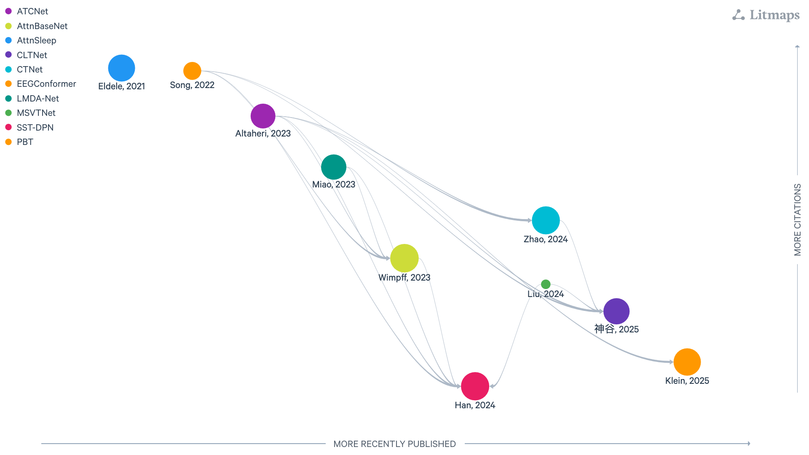

:html_theme.sidebar_secondary.remove: true

.. currentmodule:: braindecode.models

.. _models:

|attention-icon| Small Attention models
~~~~~~~~~~~~~~~~~~~~~~~~~~~~~~~~~~~~~~~~

.. |attention-icon| image:: ../../_static/model_cat/attention.png
   :height: 56px
   :alt: Small Attention icon
   :class: heading-icon no-scaled-link

:bdg-info:`Small Attention`

    Figure: `LitMap <https://app.litmaps.com/shared/43fcc2cf-9b67-48be-8c83-5e7b3764aaab>`__ **with small attention core components for EEG architectures, last updated 26/08/2025.** Each node is a paper; rightward means more recently published, upward more cited, and links show amount of citation with logaritm scale.

.. include:: ../links.inc

.. raw:: html

  
