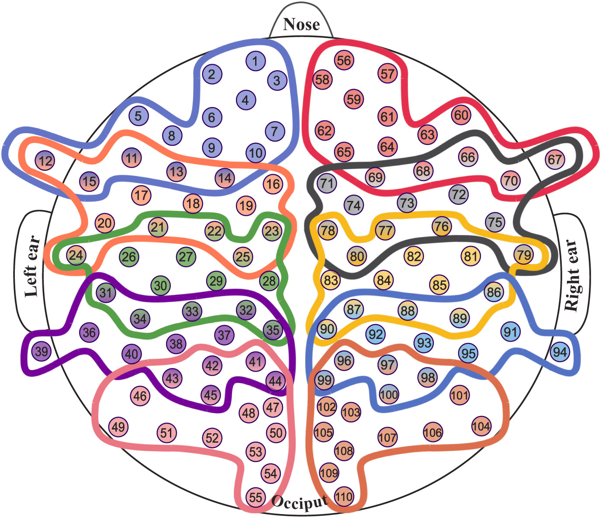

:html_theme.sidebar_secondary.remove: true

.. currentmodule:: braindecode.models

.. _models:

|channel-iconchannel| Channel-Domain
~~~~~~~~~~~~~~~~~~~~~~~~~~~~~~~~~~~~~~~~~~~~~~~~

  :bdg-light:`Channel-Domain`

.. figure:: ../../_static/model_connection/gnn.png
    :width: 100%
    :align: center

    Figure: `LitMap <https://app.litmaps.com/shared/7b301d7d-ade1-4134-9407-9fad80e009db>`__ **with neural network layers that use montage information with spatial filtering / channel / hemisphere / brain region selection strategies., last updated 26/08/2025.** Each node is a paper; rightward means more recently published, upward more cited, and links show amount of citation with logaritm scale.

.. include:: ../links.inc

.. raw:: html

  
