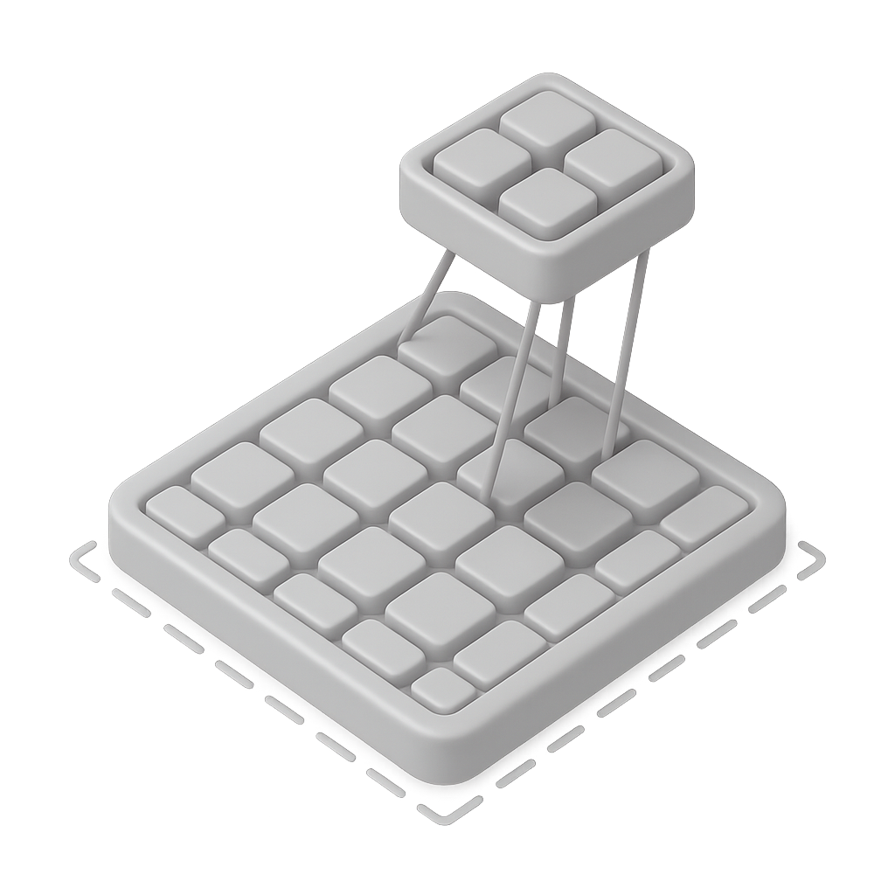

:html_theme.sidebar_secondary.remove: true

.. currentmodule:: braindecode.models

.. _models:

|conv-icon| Convolution-layer models
~~~~~~~~~~~~~~~~~~~~~~~~~~~~~~~~~~~~

:bdg-success:`Convolution`

SPNet/Deep4Net and EEGNet—to later convolutional variants such as EEG-TCNet, EEG-Inception, and EEG-ITNet, with recent additions like EEGNeX and EEG-SimpleConv.
    :class: no-scaled-link

    Figure: `LitMap <https://app.litmaps.com/shared/7b301d7d-ade1-4134-9407-9fad80e009db>`__ **of convolutional only braindecode EEG architectures, last updated 26/08/2025.** Each node is a paper; rightward means more recently published, upward more cited, and links show amount of citation with logaritm scale. The map traces the line from early :class:`ShallowFBCSPNet`/:class:`Deep4Net` and :class:`EEGNet`—to later convolutional variants such as :class:`EEGTCNet`, :class:`EEGInceptionMI`, :class:`EEGInceptionERP`, and :class:`EEGITNet`, with recent additions like :class:`EEGNeX` and :class:`EEGSimpleConv`. TO-DO: discuss the USleep, Chambon, DeepSleepNet.

.. include:: ../links.inc

.. raw:: html

  
