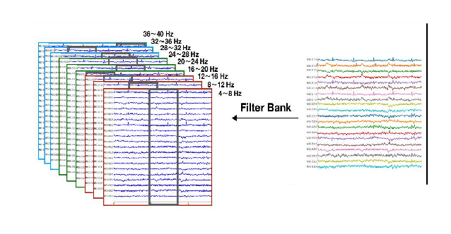
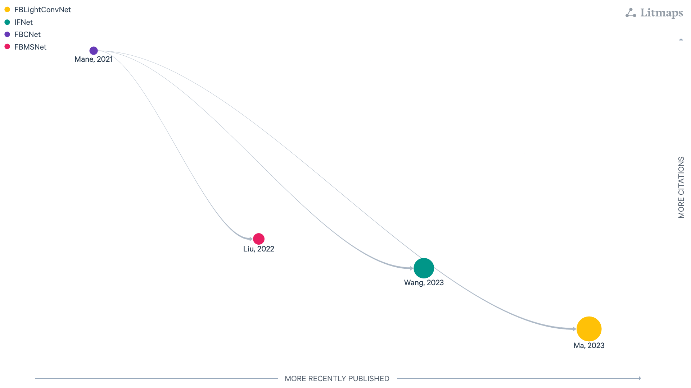

:html_theme.sidebar_secondary.remove: true

.. currentmodule:: braindecode.models

.. _models:

|filterbank-icon| FilterBank models
~~~~~~~~~~~~~~~~~~~~~~~~~~~~~~~~~~

:bdg-primary:`FilterBank`

    Figure: `LitMap <https://app.litmaps.com/shared/be03411d-4526-4557-a9f2-ec3d99773ea1>`__ **with filter bank core design, last updated 26/08/2025.** Each node is a paper; rightward means more recently published, upward more cited, and links show amount of citation with logaritm scale.

.. include:: ../links.inc

.. raw:: html

  
