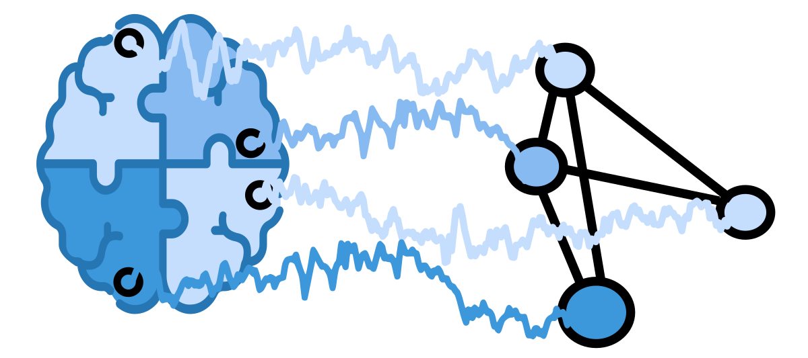

:html_theme.sidebar_secondary.remove: true

.. currentmodule:: braindecode.models

.. _models_gnn:

##################################
 |gnn-icon| Graph Neural Networks
##################################

:bdg-light:`Graph Neural Network`

This category contains graph-based models that treat EEG electrodes as graph nodes and
learn inter-channel relationships dynamically.

.. rubric:: Available Models

- :class:`DGCNN` — Dynamic Graph Convolutional Neural Network. Treats electrodes as
  nodes, builds a k-NN graph in feature space at each layer, and uses EdgeConv blocks to
  learn multi-scale spatial relationships. Based on Song et al. (2018).

.. include:: ../../links.inc

.. raw:: html

    
