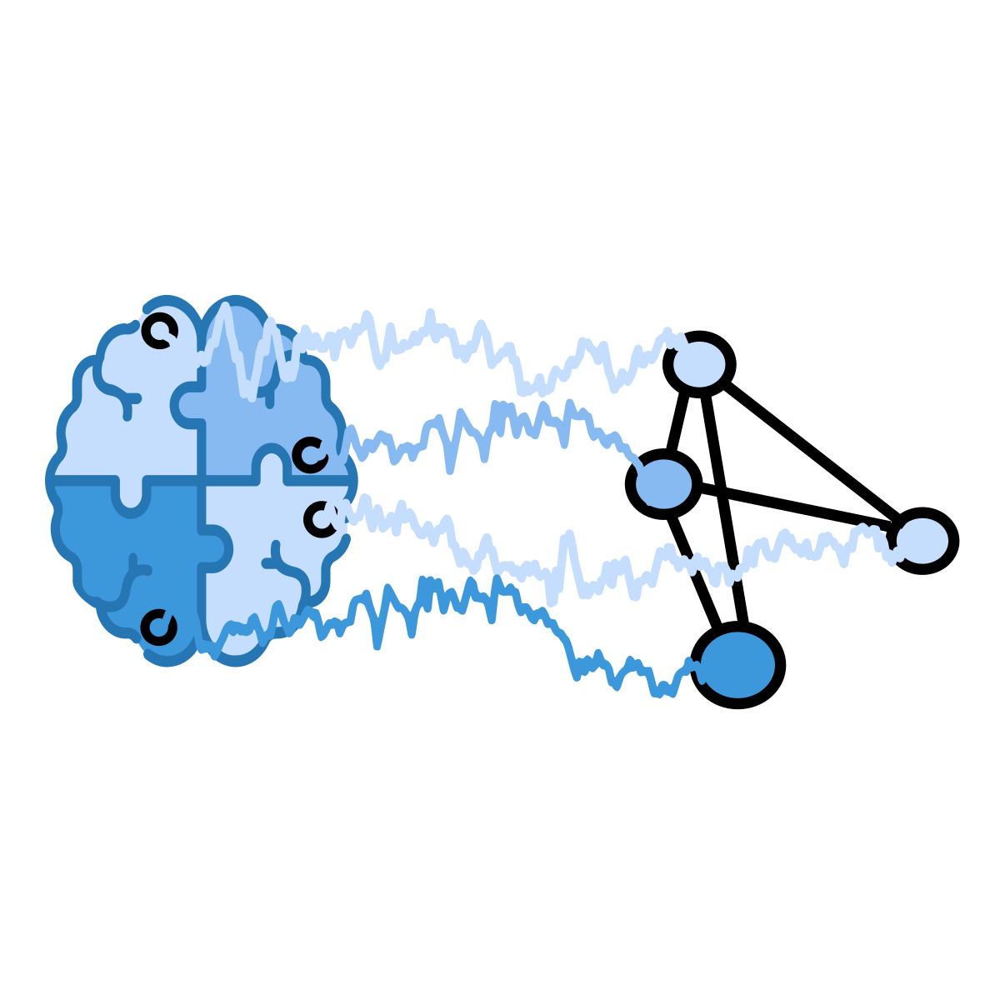

:html_theme.sidebar_secondary.remove: true

.. currentmodule:: braindecode.models

.. _models:

|gnn-icon| Graph Neural Networks
~~~~~~~~~~~~~~~~~~~~~~~~~~~~~~~~~~~~~~~~~~~~~~~~

:bdg-light:`Graph Neural Network`

.. figure:: ../../_static/model_connection/litmap_gnn.png
    :width: 100%
    :align: center

    I doesn't know much about GNNs for EEG yet. No LitMap available.

.. include:: ../links.inc

.. raw:: html

  
