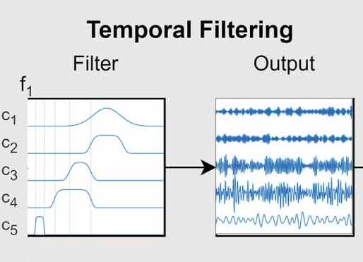
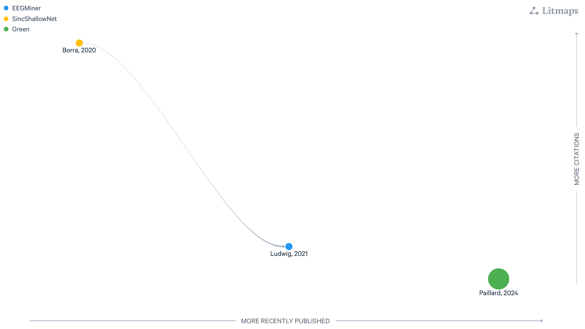

:html_theme.sidebar_secondary.remove: true

.. currentmodule:: braindecode.models

.. _models:

|inter-icon|  Interpretability-by-Design
~~~~~~~~~~~~~~~~~~~~~~~~~~~~~~~~~~~~~~~~~

:bdg-warning:`Interpretability-by-Design`

    Figure: `LitMap <https://app.litmaps.com/shared/4ab67d8d-603f-4907-93a1-040cb06f91ec>`__ **with interpretable by design layers, last updated 26/08/2025.** Each node is a paper; rightward means more recently published, upward more cited, and links show amount of citation with logaritm scale.

.. include:: ../links.inc

.. raw:: html

  
