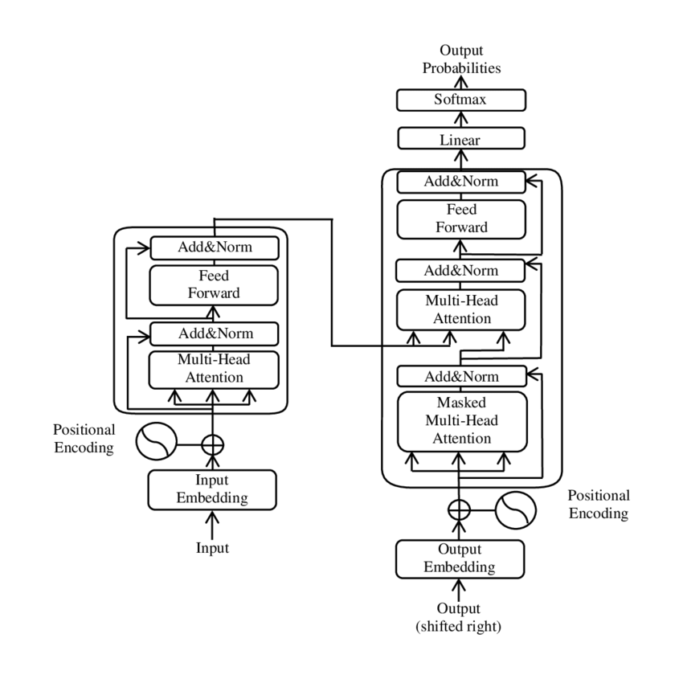
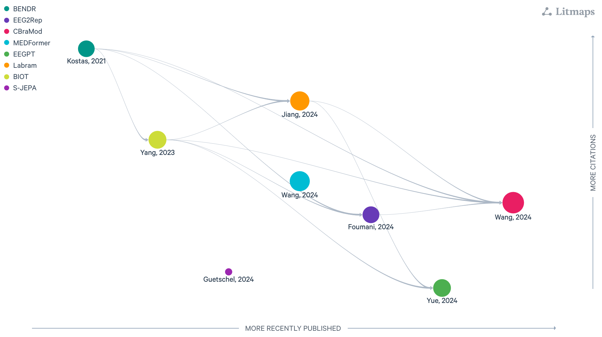

:html_theme.sidebar_secondary.remove: true

.. currentmodule:: braindecode.models

.. _models:

|lbm-icon| Large Brain Models
~~~~~~~~~~~~~~~~~~~~~~~~~~~~~~~~~~~~~~~~~~~~~~~~

:bdg-danger:`Large Brain Models`

    Figure: `LitMap <https://app.litmaps.com/shared/e33fb41d-bc98-407f-9372-437f2b59a140>`__ **with large brain model layers, last updated 26/08/2025.** Each node is a paper; rightward means more recently published, upward more cited, and links show amount of citation with logaritm scale.

.. include:: ../links.inc

.. raw:: html

  
