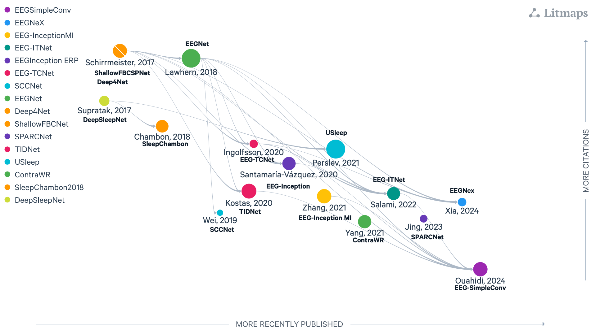

:html_theme.sidebar_secondary.remove: true

.. currentmodule:: braindecode.models

.. _models:

|rnn-icon| Recurrent-layer models
~~~~~~~~~~~~~~~~~~~~~~~~~~~~~~~~~~

.. |rnn-icon| image:: ../../_static/model_cat/rnn.png
   :height: 56px
   :alt: Recurrent icon
   :class: heading-icon no-scaled-link

:bdg-secondary:`Recurrent`

    Figure: `LitMap <https://app.litmaps.com/shared/7b301d7d-ade1-4134-9407-9fad80e009db>`__ **with Sequential core components braindecode EEG architectures, last updated 26/08/2025.** Each node is a paper; rightward means more recently published, upward more cited, and links show amount of citation with logaritm scale.

.. include:: ../links.inc

.. raw:: html

  
