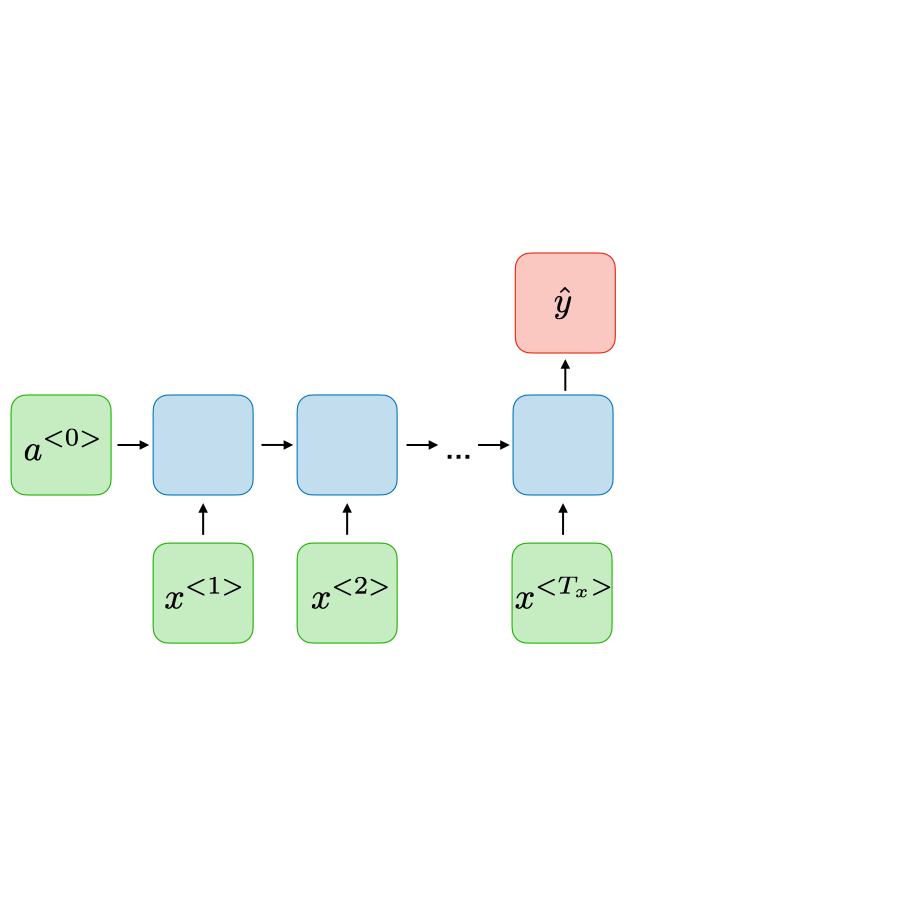
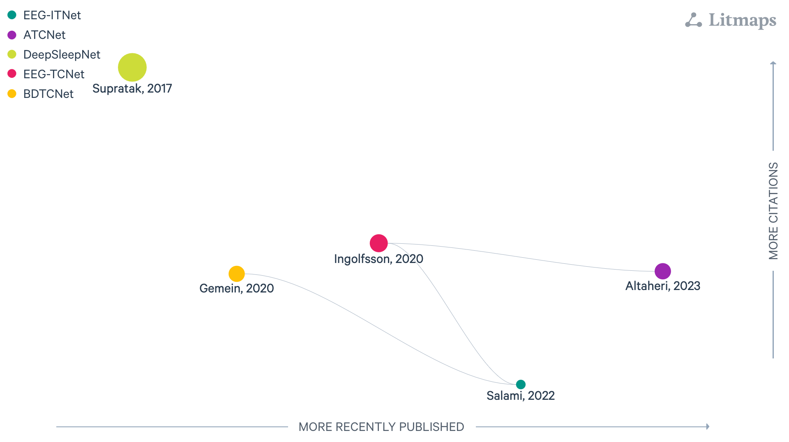

:html_theme.sidebar_secondary.remove: true

.. currentmodule:: braindecode.models

.. _models_recurrent:

|rnn-icon| Recurrent-layer models
~~~~~~~~~~~~~~~~~~~~~~~~~~~~~~~~~~

:bdg-secondary:`Recurrent`

    Figure: `LitMap <https://app.litmaps.com/shared/1c0f18a3-beaa-4222-ae8a-8b7fddd7d5cd>`__ **with Recurrent-layer core components for EEG architectures, last updated 26/08/2025.** Each node is a paper; rightward means more recently published, upward more cited, and links show amount of citation with logaritm scale.

.. include:: ../../links.inc

.. raw:: html

  
