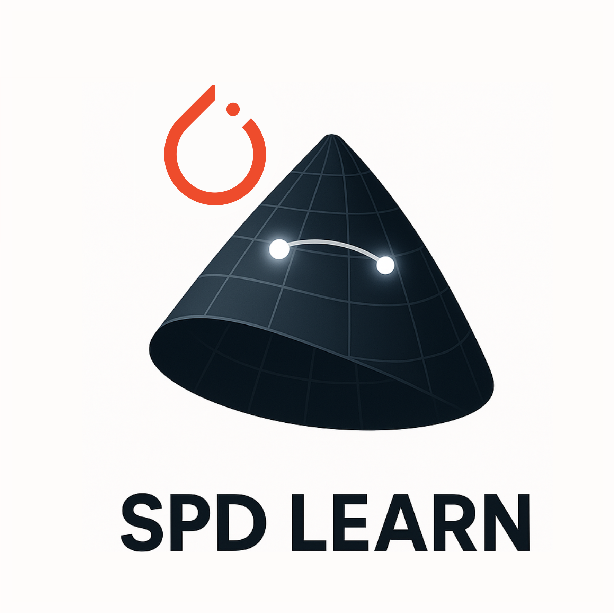
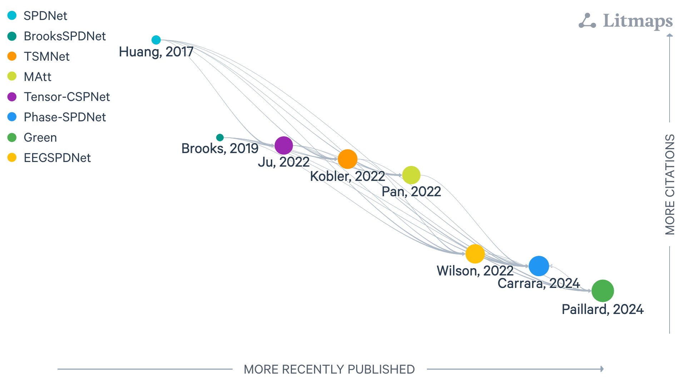

:html_theme.sidebar_secondary.remove: true

.. currentmodule:: braindecode.models

.. _models:

|spd-icon|  Symmetric Positive-Definite
~~~~~~~~~~~~~~~~~~~~~~~~~~~~~~~~~~~~~~~~~~~~~~~~

:bdg-dark:`Symmetric Positive-Definite`

    Figure: `LitMap <https://app.litmaps.com/shared/bcd44ea5-9d52-46ed-9948-4b34714d4f05>`__ **with symmetric positive-definite layers, last updated 26/08/2025.** Each node is a paper; rightward means more recently published, upward more cited, and links show amount of citation with logaritm scale.

.. include:: ../links.inc

.. raw:: html

  
