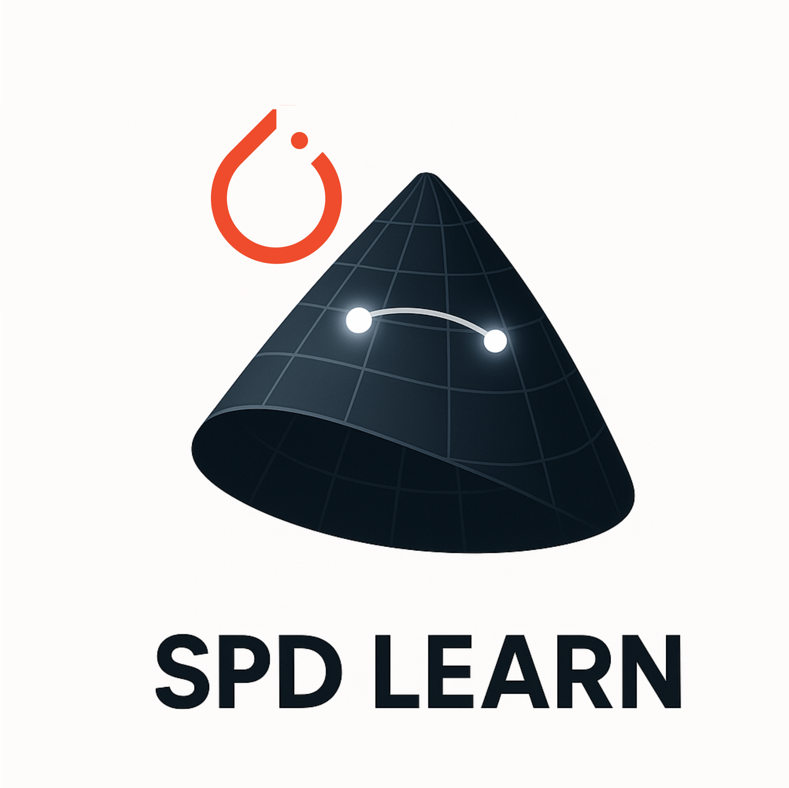
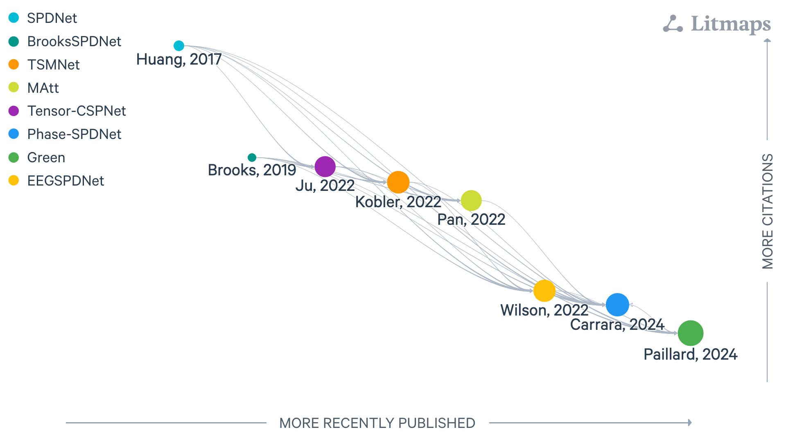

:html_theme.sidebar_secondary.remove: true

.. currentmodule:: braindecode.models

.. _models_spd:

########################################
 |spd-icon| Symmetric Positive-Definite
########################################

:bdg-success:`Symmetric Positive-Definite (SPD)`

SPD / Riemannian methods operate on covariance (or connectivity) matrices as points on
the SPD manifold, combining layers such as BiMap, ReEig, and LogEig. These models are
available through the spd_learn_ library (:cite:label:`aristimunha2026spd`), a
pure-PyTorch library for geometric deep learning on SPD matrices designed for neural
decoding.

**************
 Installation
**************

.. code-block:: bash

    pip install spd-learn

******************
 Available models
******************

.. list-table::
    :header-rows: 1
    :widths: 25 75

    - - Model
      - Description
    - - :class:`~spd_learn.models.SPDNet`
      - Foundational architecture for deep learning on SPD manifolds; performs dimension
        reduction while preserving SPD structure using BiMap, ReEig, and LogEig layers
        (:cite:label:`huang2017riemannian`).
    - - :class:`~spd_learn.models.EEGSPDNet`
      - Specialized for brain-computer interface applications; combines covariance
        estimation with SPD network layers.
    - - :class:`~spd_learn.models.TSMNet`
      - Tangent Space Mapping Network that integrates convolutional processing with
        Riemannian geometry.
    - - :class:`~spd_learn.models.TensorCSPNet`
      - SPDNet variant incorporating Tensor Common Spatial Patterns for multi-band EEG
        feature extraction.
    - - :class:`~spd_learn.models.PhaseSPDNet`
      - Leverages instantaneous phase information from analytic signals using Hilbert
        transforms.
    - - :class:`~spd_learn.models.Green`
      - Gabor Riemann EEGNet combining Gabor wavelets with Riemannian geometry for
        robust EEG decoding.
    - - :class:`~spd_learn.models.MAtt`
      - Matrix Attention network for SPD manifold learning.

**********
 Citation
**********

If you use the SPD models, please cite the spd_learn library:

.. code-block:: bibtex

    @article{aristimunha2026spd,
      title={SPD Learn: A Geometric Deep Learning Python Library for Neural
             Decoding Through Trivialization},
      author={Aristimunha, Bruno and Ju, Ce and Collas, Antoine and
              Bouchard, Florent and Mian, Ammar and Thirion, Bertrand and
              Chevallier, Sylvain and Kobler, Reinmar},
      journal={arXiv preprint arXiv:2602.22895},
      year={2026}
    }

********
 LitMap
********

    Figure: `LitMap
    <https://app.litmaps.com/shared/bcd44ea5-9d52-46ed-9948-4b34714d4f05>`__ **with
    symmetric positive-definite layers, last updated 26/08/2025.** Each node is a paper;
    rightward means more recently published, upward more cited, and links show amount of
    citation with logaritm scale.

.. include:: ../../links.inc

.. raw:: html

    
