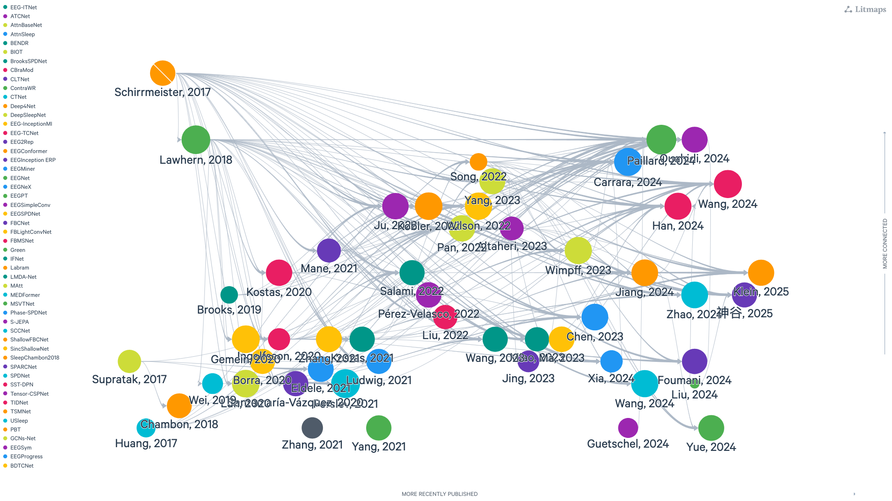

:html_theme.sidebar_secondary.remove: true

Visualization
~~~~~~~~~~~~~

Good model understanding begins with two questions: what is it for, and how big is it? The figures below list both for each model:

   Static snapshot exported from Litmaps.
   Interactive version available at `Litmaps <https://app.litmaps.com/shared/32a517b1-ed41-463f-8ca0-7b49e2a2443e>`_.

.. raw:: html
   :file: ../_static/model/models_analysis.html

.. raw:: html

   

     Visualization comparing the models based on their total number of parameters (left)
     and the primary experimental paradigm (right).
   

We are continually expanding this collection and welcome contributions! If you have implemented a model relevant to EEG, EcoG, or MEG analysis, consider adding it to Braindecode.
If you also want to push some extra plot for some possible angle, we are open to *good* pull requests.

.. include:: /links.inc
